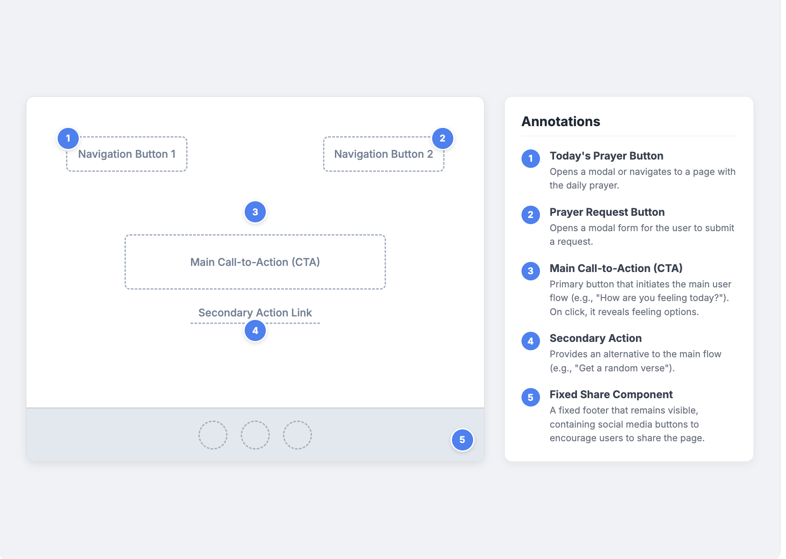
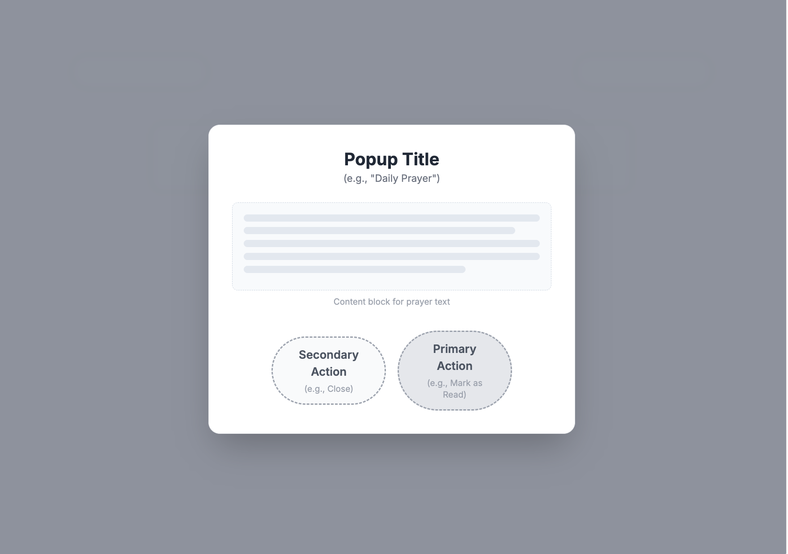

# The Word of God

The Word of God is a responsive front-end website created as part of the Code Institute Full-Stack Developer course.  
It is designed to be an interactive and spiritual space where users can find Bible verses, daily prayers, and share prayer requests.  
The goal is to provide comfort, encouragement, and inspiration in a minimalist, mobile-friendly experience.

👉 [View the live project here](https://oliveiracle.github.io/secondproject-the-word-of-god/)

---

## Technologies Used
- HTML5
- CSS3
- JavaScript
- Git & GitHub
- VS Code

---

## Site Owner Goals
- **Provide spiritual comfort** by creating a space where users can access verses and prayers that bring peace.  
- **Offer personalized guidance** through verses tailored to the user’s emotions.  
- **Encourage daily spiritual practice** with the *“Today’s Prayer”* feature.  
- **Foster community and support** via the prayer request form.  
- **Make inspiration accessible** with the random verse generator.  

---

## User Stories

1. As a user feeling overwhelmed, I want to click the *“How are you feeling today?”* button, so that I can see my emotional options.  
2. As a user looking for a word of comfort, I want to click on one of the emotion buttons, so that a relevant Bible verse is displayed.  
3. As a user who wants daily spiritual inspiration, I want to click the *“Today’s Prayer”* button, so that I can read a new prayer every day.  
4. As a user who wants a random message of hope, I want to click the *“Or get a random verse for your day”* link, so that a new verse is displayed.  
5. As a user in need of spiritual support, I want to fill out and submit the prayer request form, so that others can pray for me.  

---

## UX Design

### The Psychology of Colors in the Project

Our color palette was carefully selected to visually convey the project’s mission: to offer a haven of peace and clarity. Each shade plays a key role in creating a reading experience that is both focused and spiritually uplifting.

- ** Dark Tones (#222 and #333): Represent the solidity and timelessness of the message. They ensure that the text remains the central focus, providing comfortable, distraction-free reading while conveying authority and trust.

- ** Light Blue (lightblue): Our touch of serenity and hope. This color evokes a sense of calm and confidence, used strategically to illuminate the interface and guide the user intuitively and peacefully.

- ** Background (#f8feff): The foundation is a white with a subtle bluish tint, creating a clean, open, and minimalist space. It’s not just a background, but a blank canvas symbolizing the mental clarity and peace needed for reflection.
This palette was chosen to keep the site visually peaceful, clean, and uplifting.

### Typography: A Balance of Personality and Clarity

The typographic strategy was designed to be warm and engaging, balancing a personal, handwritten font with a clean, modern sans-serif for optimal readability. This pairing creates a clear hierarchy and guides the user through a friendly and accessible experience.

- **Heading Font (Gloria Hallelujah):** *The Personal Touch.* Used for main titles to create a human and friendly connection. Its handwritten style brings warmth and an inviting personality to the forefront.

- **Body Font (Quicksand):** *The Foundation of Clarity.* Chosen for all body text, menus, and buttons to ensure a comfortable and highly readable experience on any device. Its clean, modern aesthetic complements the heading font without competing for attention.

- **Accent Font (Leckerli One):** *The Elegant Signature.* Reserved for key brand elements like the logo or special call-to-actions. It adds a touch of sophistication and reinforces a unique, memorable brand identity.  
 

### Wireframes & User Flow

To ensure an intuitive and serene user experience, a series of wireframes were designed to map out the core user journey. The focus was on creating a minimalist layout that guides the user gently, eliminating distractions and focusing on the main purpose of the application.

#### Step 1: The Home Page (Desktop)

The main goal of the home page is to welcome the user in a calm and focused environment, immediately presenting the central purpose of the site.

The layout is intentionally simple and centered around three key interactions:

1.  **Main Call-to-Action (CTA):** The user's journey is initiated by a single, clear call-to-action ("How are you feeling today?"). This is the primary path.
2.  **Secondary Navigation:** Essential but non-critical options ("Today's Prayer" and "Prayer Request") are placed at the corners to be accessible but not distracting.
3.  **Alternative Path:** A secondary, less prominent link ("Or get a random verse") offers a direct alternative for users who don't wish to follow the main flow.

This initial screen is designed to be a peaceful entry point, leading the user seamlessly to the next step: selecting their feeling to receive a tailored verse.

### Step 2: The Daily Prayer Popup
This flow is triggered when the user clicks on the "Today's Prayer" navigation button from the main screen. The goal is to present the prayer in a focused, immersive environment without navigating away from the home page.

The decision to use a popup modal is strategic. It creates a focused environment by using a blurred overlay to remove all other distractions, allowing the user to concentrate solely on the prayer. This approach also preserves the user's context, as they can easily return to the main interface without losing their place.

The popup's layout is structured for simplicity and function:

Clear Title: Immediately identifies the purpose of the popup.

Content Block: A well-defined and readable text area for the prayer.

Action Buttons: Two buttons with distinct purposes:

Primary Action ("Mark as Read"): Provides a sense of completion for the user.

Secondary Action ("Close"): Offers a simple and universal way to dismiss the modal.

This interaction provides a moment of reflection before the user seamlessly returns to the main flow.

### Step 3: The Prayer Request Popup
This flow is initiated when the user clicks on the "Prayer Request" navigation button. The goal is to provide a simple, private, and accessible way for users to submit a prayer request without disrupting their main experience.

Using a popup modal for this feature is a deliberate choice. It provides a focused and distraction-free interface for form submission, ensuring user privacy and concentration. Once the interaction is complete, the user is returned seamlessly to the home page.

The form's layout is designed for clarity and ease of use:

1. Clear Title: The title "Prayer Request" immediately clarifies the purpose of the modal.

2. Minimalist Form: Two straightforward input fields ("Your name" and "Write your prayer request...") make the submission process quick and intuitive.

3. Distinct Actions: The buttons are clearly defined:

Primary Action ("Send"): The main goal of the form, visually emphasized.

Secondary Action ("Close"): Allows the user to easily cancel the action without any friction.

This feature is designed to foster a sense of community and support in a seamless and respectful manner.

#### Mobile Wireframes
For mobile devices, the design was adapted to a single-column layout to ensure a clean, focused, and user-friendly experience on smaller screens. The priority is to maintain the same serene atmosphere while making all interactions easily accessible with one hand.

### Step 4: The Home Page (Mobile)
The mobile home page retains the core functionality of the desktop version but stacks the elements vertically for a natural and intuitive flow.

Key adaptations for the mobile layout include:

1. Optimized Navigation: The two main navigation buttons ("Today's Prayer" and "Prayer Request") are positioned at the top of the screen, providing immediate access without cluttering the primary interaction area.

2. Prominent CTA: The main call-to-action remains the central focus, enlarged to be easily tappable and immediately draw the user's attention.

3. Vertical Hierarchy: All elements are arranged in a clear vertical hierarchy, guiding the user's eye downwards from the navigation options to the primary and secondary actions, ensuring a seamless experience.

This approach ensures that the application is just as powerful and easy to use on a mobile device as it is on a desktop.

---

## Features

### Existing Features

- **Main Button – “How are you feeling today?”**  
   - Opens a set of emotion buttons, guiding the user to personalized verses.

- **Emotion Buttons**  
   - Each button displays a verse based on the selected emotion (sadness, joy, anxiety, etc.).  
   - Verses are displayed randomly from the corresponding category.

- **“Today’s Prayer” Feature**  
   - Displays a unique prayer in a popup window.  
   - Encourages users to return daily.

- **Random Verse Generator**  
   - Provides an instant Bible verse for users who don’t have a specific emotion in mind.

- **Prayer Request Form**  
   - Users can submit their personal prayer requests via a popup form.  
   - Simple validation ensures the form is filled before submission.  
   - Confirmation is displayed after sending the request.  

- **Responsive Design**  
   - Fully responsive layout with mobile-first design.  
   - Navigation, popups, and buttons adapt to different screen sizes.  

---

## Features Left to Implement
- Ability to save user’s favorite verses.  
- Prayer request submissions stored in a backend database.  
- Daily verse delivered via notification or email subscription.  

---

## Testing

### Manual Testing - IT HAS TO BE DONE
- All links and buttons were tested to ensure correct functionality.  
- Prayer request form tested with both valid and invalid inputs.  
- Verses and prayers display correctly across all devices.  
- Popups tested to open and close without issues.  
- Layout tested on Chrome, Safari, and mobile devices.  

### Validator Testing - IT HAS TO BE DONE
- **HTML:** Passed through [W3C Validator](https://validator.w3.org/) with no errors.  
- **CSS:** Passed through [Jigsaw CSS Validator](https://jigsaw.w3.org/css-validator/) with no errors.  
- **Accessibility:** Achieved high scores on Lighthouse audits.  

---

## Deployment
The site was deployed using **GitHub Pages**:  

1. Go to the repository on GitHub.  
2. Click on the **Settings** tab.  
3. Scroll down to **Pages**.  
4. Under **Source**, select the `main` branch and set folder to `/ (root)`.  
5. Save, and GitHub will provide a deployment link.  

👉 Live Project: [The Word of God](https://oliveiracle.github.io/secondproject-the-word-of-god/)  

---

## Credits

### Content & Design Inspiration
- Bible verses and prayers were sourced from the **Holy Bible (NIV translation)**.  
- Color palette inspired by **soft spiritual tones**, mixing white, beige, and light blue for serenity.  
- Handwritten typography for warmth and personal touch.  
- README structure adapted from Code Institute’s recommended format.  

### Media
- Icons sourced from [Font Awesome](https://fontawesome.com/).  
- Backgrounds and illustrations adapted from free resources on [Pexels](https://www.pexels.com/) and [Unsplash](https://unsplash.com/).  

### Acknowledgements
- **Code Institute**: For project structure and learning guidance.  
- **Stack Overflow & CSS-Tricks**: For support on responsive popups and JavaScript event handling.  
- **Google & GitHub Copilot**: Assisted in debugging and structuring the JavaScript logic.  

---
