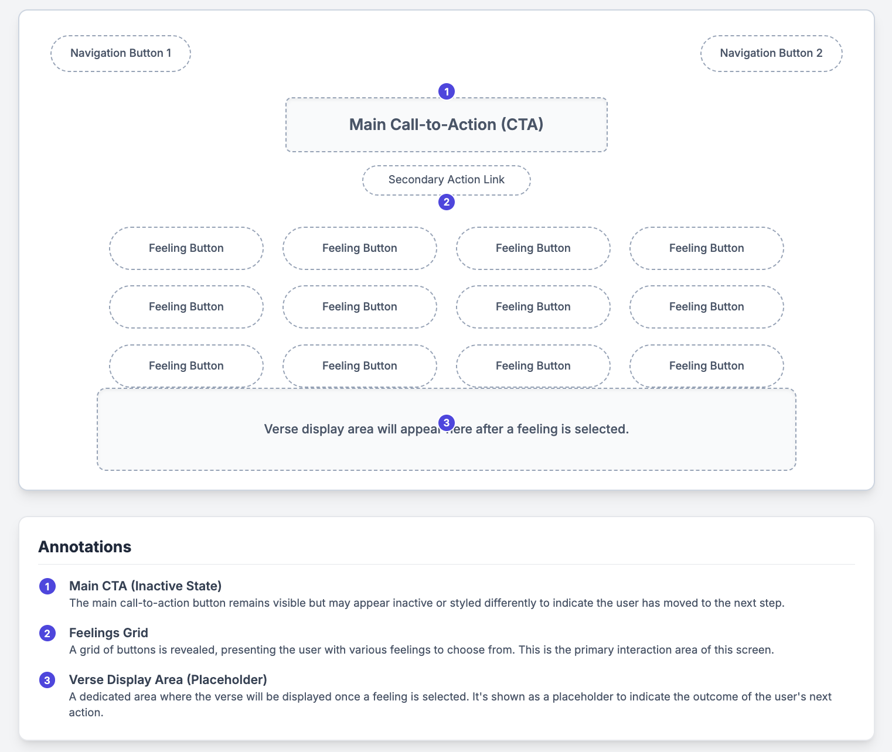
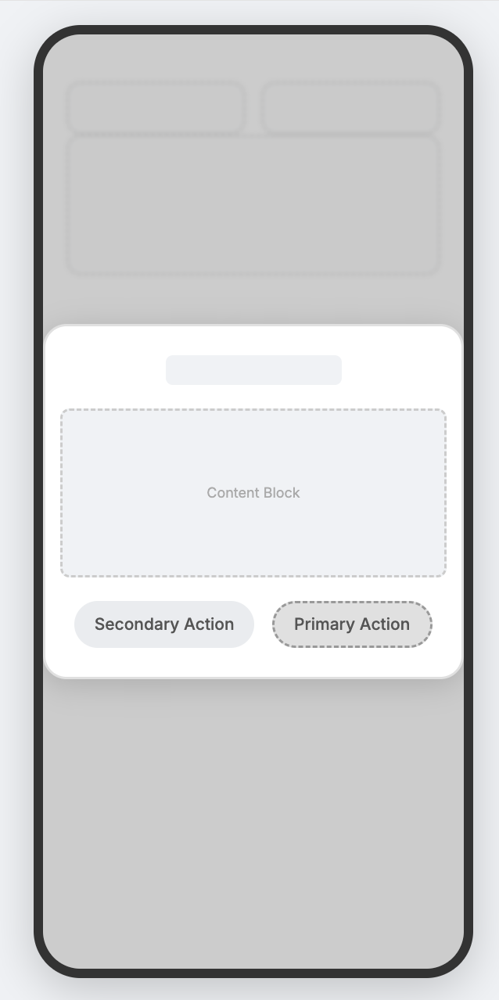
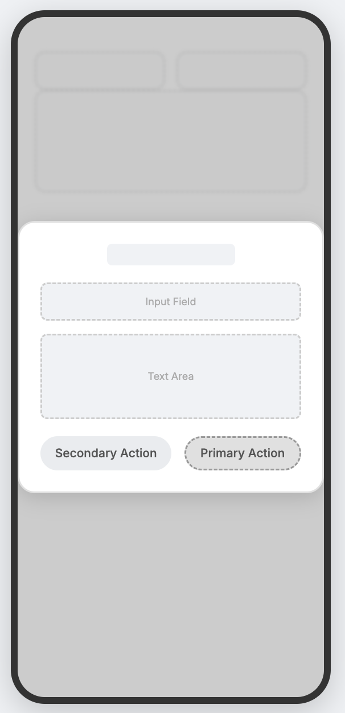

# The Word of God

This project was born from my faith and a deep desire to share the comfort and hope that I find in God's Word. "Peace in the Word" is more than just a website; it is a digital sanctuary created to bring the love of Jesus Christ to those in need.

My goal is to offer a peaceful space where anyone, at any time, can find a word of encouragement through Bible verses, daily prayers, and a community that prays for one another. To ensure this message is accessible to everyone, the site was built with a minimalist and fully responsive design.

👉 [View the live project here](https://oliveiracle.github.io/secondproject-the-word-of-god/)

---

## Technologies Used
- HTML5
- CSS3
- JavaScript
- Git & GitHub
- VS Code

---

## Site Owner Goals
- **Provide spiritual comfort** by creating a space where users can access verses and prayers that bring peace.  
- **Offer personalized guidance** through verses tailored to the user’s emotions.  
- **Encourage daily spiritual practice** with the *“Today’s Prayer”* feature.  
- **Foster community and support** via the prayer request form.  
- **Make inspiration accessible** with the random verse generator. 
- **Encourage Sharing and Growth** to help the message of hope reach more people, the site includes simple and accessible sharing options, fostering organic community growth. 

---

## User Stories

1. As a user feeling overwhelmed, I want to click the *“How are you feeling today?”* button, so that I can see my emotional options.  
2. As a user looking for a word of comfort, I want to click on one of the emotion buttons, so that a relevant Bible verse is displayed.  
3. As a user who wants daily spiritual inspiration, I want to click the *“Today’s Prayer”* button, so that I can read a new prayer every day.  
4. As a user who wants a random message of hope, I want to click the *“Or get a random verse for your day”* link, so that a new verse is displayed.  
5. As a user in need of spiritual support, I want to fill out and submit the prayer request form, so that others can pray for me.  

---

## UX Design

### The Psychology of Colors in the Project

Our visual identity is built on a dual-palette strategy to create an experience that is both spiritually warm and functionally clear. We combine an atmospheric background with a clean, focused user interface.

**1. The Atmospheric Palette (The Heart of the Site)**

The user is welcomed by a background image rich in soft, warm, and earthy tones—the gentle whites of a dove and the natural beiges of open hands. This visual foundation sets the emotional tone of the site:

* **Warmth and Humanity:** The beige and organic tones create a welcoming, human, and comforting atmosphere.
* **Spirituality and Peace:** The imagery of the dove and the cross evokes a sense of peace, hope, and the presence of the Holy Spirit.

**2. The User Interface Palette (The Clarity of the Message)** 

Floating above this warm atmosphere is a clean, minimalist UI palette designed for focus and readability.

* **Dark Tones (`#222` and `#333`):** Represent the **solidity and timelessness** of the message. They provide maximum contrast for comfortable, distraction-free reading, conveying authority and trust.
* **Light Blue (`lightblue`):** Our touch of **serenity and clarity**. This cool color complements the warm background, evoking a sense of calm and confidence. It is used strategically to guide the user's actions peacefully.
* **Background (`#f8feff`):** The foundation for all content is a white with a subtle bluish tint, creating a **clean and open space**. It acts as a canvas that elevates the Word, symbolizing the mental clarity needed for reflection.

This combination ensures that the user feels welcomed and at peace (from the background) while being able to interact with the message clearly and without effort (from the UI).

### Typography: A Balance of Personality and Clarity

The typographic strategy was designed to be warm and engaging, balancing a personal, handwritten font with a clean, modern sans-serif for optimal readability. This pairing creates a clear hierarchy and guides the user through a friendly and accessible experience.

- **Heading Font (Gloria Hallelujah):** *The Personal Touch.* Used for main titles to create a human and friendly connection. Its handwritten style brings warmth and an inviting personality to the forefront.

- **Body Font (Quicksand):** *The Foundation of Clarity.* Chosen for all body text, menus, and buttons to ensure a comfortable and highly readable experience on any device. Its clean, modern aesthetic complements the heading font without competing for attention.

- **Accent Font (Leckerli One):** *The Elegant Signature.* Reserved for key brand elements like the logo or special call-to-actions. It adds a touch of sophistication and reinforces a unique, memorable brand identity.  
 
### Wireframes & User Flow

To ensure an intuitive and serene user experience, a series of wireframes were designed to map out the core user journey. The focus was on creating a minimalist layout that guides the user gently, eliminating distractions and focusing on the main purpose of the application.

### Desktop Wireframes

#### Step 1: The Home Page 
The main goal of the home page is to welcome the user in a calm and focused environment, immediately presenting the central purpose of the site. The layout is intentionally simple and centered around four key interactions.

1. Main Call-to-Action (CTA): The user's journey is initiated by a single, clear call-to-action ("How are you feeling today?"). This is the primary path.

2. Secondary Navigation: Essential but non-critical options ("Today's Prayer" and "Prayer Request") are placed at the corners to be accessible but not distracting.

3. Alternative Path: A secondary, less prominent link ("Or get a random verse") offers a direct alternative for users who don't wish to follow the main flow.

4. Fixed Share Component: A fixed footer remains visible at the bottom of the screen. It contains social media share buttons, providing a constant but unobtrusive encouragement for users to share the site with others.

This initial screen is designed to be a peaceful entry point, leading the user seamlessly to the next step while also facilitating the site's organic growth through sharing.

#### Step 2: Feelings Selection Screen

After the user clicks the main call-to-action on the home page, the interface transitions to reveal the feelings selection screen. The goal of this step is to present a clear and accessible grid of options that allows the user to easily identify and select their current emotional state.

The layout is designed to guide the user through this selection process smoothly:

1. Inactive CTA: The main call-to-action remains on screen but is visually de-emphasized. This maintains context, showing the user the origin of their current step without being an active element.

2. Feelings Grid: This is the primary interaction area. A structured grid of buttons is displayed, each representing a different feeling. This layout allows for quick scanning and easy comparison of the available options.

3. Verse Display Placeholder: A dedicated area is shown at the bottom of the screen. This placeholder clearly communicates to the user where the result of their selection (the verse) will appear, setting expectations for the next and final step of the flow.

#### Step 3: The Daily Prayer Popup
This flow is triggered when the user clicks on the "Today's Prayer" navigation button from the main screen. The goal is to present the prayer in a focused, immersive environment without navigating away from the home page.

The decision to use a popup modal is strategic. It creates a focused environment by using a blurred overlay to remove all other distractions, allowing the user to concentrate solely on the prayer. This approach also preserves the user's context, as they can easily return to the main interface without losing their place.

1. The popup's layout is structured for simplicity and function:

2. Clear Title: Immediately identifies the purpose of the popup.

3. Content Block: A well-defined and readable text area for the prayer.

4. Action Buttons: Two buttons with distinct purposes:

5. Primary Action ("Mark as Read"): Provides a sense of completion for the user.

6. Secondary Action ("Close"): Offers a simple and universal way to dismiss the modal.

This interaction provides a moment of reflection before the user seamlessly returns to the main flow.

#### Step 4: The Prayer Request Popup
This flow is initiated when the user clicks on the "Prayer Request" navigation button. The goal is to provide a simple, private, and accessible way for users to submit a prayer request without disrupting their main experience.

Using a popup modal for this feature is a deliberate choice. It provides a focused and distraction-free interface for form submission, ensuring user privacy and concentration. Once the interaction is complete, the user is returned seamlessly to the home page.

The form's layout is designed for clarity and ease of use:

1. Clear Title: The title "Prayer Request" immediately clarifies the purpose of the modal.

2. Minimalist Form: Two straightforward input fields ("Your name" and "Write your prayer request...") make the submission process quick and intuitive.

3. Distinct Actions: The buttons are clearly defined:

4. Primary Action ("Send"): The main goal of the form, visually emphasized.

5. Secondary Action ("Close"): Allows the user to easily cancel the action without any friction.

This feature is designed to foster a sense of community and support in a seamless and respectful manner.

### Mobile Wireframes
For mobile devices, the design was adapted to a single-column layout to ensure a clean, focused, and user-friendly experience on smaller screens. The priority is to maintain the same serene atmosphere while making all interactions easily accessible with one hand.

#### Step 5: The Home Page 
On mobile devices, after the user interacts with the main CTA, the interface transitions to display the feelings selection screen. The layout is adapted into a touch-friendly, two-column grid to ensure all options are easily scannable and selectable with one hand.

Key adaptations for the mobile layout include:

1. Optimized Navigation: The two main navigation buttons ("Today's Prayer" and "Prayer Request") are positioned at the top of the screen, providing immediate access without cluttering the primary interaction area.

2. Prominent CTA: The main call-to-action remains the central focus, enlarged to be easily tappable and immediately draw the user's attention.

3. Vertical Hierarchy: All elements are arranged in a clear vertical hierarchy, guiding the user's eye downwards from the navigation options to the primary and secondary actions, ensuring a seamless experience.

4 .Persistent Share Footer: The fixed footer with the share buttons for Facebook, X (Twitter), and WhatsApp remains visible at the bottom of the screen. This ensures that the option to share the site is always available, even as the user navigates through the main flow.

This approach ensures that the application is just as powerful and easy to use on a mobile device as it is on a desktop.

#### Step 6: Feelings Selection Screen 

On mobile devices, after the user taps the main CTA, the interface transitions to the feelings selection screen. The layout is adapted into a two-column grid, optimized for vertical scrolling and easy tapping on a smaller screen.

The design strategy for this screen focuses on maintaining clarity and usability:

1. Vertical Flow: The layout encourages a natural downward scroll, allowing the user to browse the full list of feelings comfortably.

3. Touch-Friendly Buttons: Each button is designed with ample spacing and a large tappable area, ensuring an error-free selection process.

4. Persistent Context: The inactive CTA remains visible at the top. This reminds the user of the action that led them here and maintains a consistent visual anchor throughout the flow.

#### Step 7: The Daily Prayer Pop-up
 
This wireframe details the interaction of the Daily Prayer popup on mobile devices. The experience has been optimized to maintain the user's full focus by adapting the modal's design for vertical screens and touch-based interactions.

Key optimizations for the mobile popup experience include:

1. Focused Overlay: The popup uses an overlay that darkens the background, eliminating distractions and centering the user's attention exclusively on the prayer's content—an even more critical approach on smaller screens.

2. Readable and Tappable Layout: The content is presented in an easy-to-read text block, and the action buttons are large and well-spaced to ensure that the interaction is simple and accessible by touch.

3. Clear Action Hierarchy: The two actions ("Mark as Read" and "Close") maintain a clear visual hierarchy, with the primary action having more emphasis to intuitively guide the user to complete or dismiss the interaction.

#### Step 7: The Prayer Request Pop-up

This wireframe details the "Prayer Request" form on mobile devices. The primary goal is to ensure the process of submitting a request is simple, private, and effortless, adapting the form's layout for a seamless touch-based experience.

The mobile adaptation focuses on clarity and ease of use:

1. Distraction-Free Form: The modal overlay provides a private and focused environment, allowing the user to write their request without any distractions from the main page.

2. Optimized for Touch: The input fields and text area are large and have ample spacing, making them easy to tap and type on a mobile screen.

3. Clear and Simple Actions: The"Send" and "Close" buttons are designed to be easily accessible, with a clear visual hierarchy that guides the user toward the primary action of submitting the form.

---

#### Core Features & User Experience
This project is designed to be more than a simple website; it's an interactive spiritual sanctuary. Every feature was crafted to be intuitive, serene, and focused on providing comfort and inspiration.

##### Interactive Verse Finder
The core experience begins with a single, welcoming call-to-action: “How are you feeling today?”. This leads the user to an interactive grid of feelings, where they can select an emotion to receive a tailored Bible verse, offering personalized guidance and comfort.

##### Daily Prayer Modal
To encourage a daily moment of reflection, the site presents a unique prayer each day in a focused, distraction-free modal window. This feature invites users to return and start their day with a moment of peace.

##### Spontaneous Inspiration
For users seeking a quick word of encouragement, the "Random Verse" option provides a spontaneous Bible verse without the need to navigate through the feelings grid.

##### Prayer Request Form
A safe and private space where users can submit their personal prayer requests through a simple and elegant form. A confirmation message assures the user that their request has been received.

##### Seamless Social Sharing
A fixed footer provides a constant but unobtrusive way to share the website on Facebook, X (Twitter), and WhatsApp. This feature was designed to help grow the community organically by making it effortless for users to share this sanctuary with others.

##### Fully Responsive Design
The entire experience is seamlessly adapted for all screen sizes, from mobile phones to desktops. The mobile-first approach ensures that the site is beautiful, functional, and accessible to everyone, everywhere.

### The Vision: Future Enhancements

#### Personal Verse Collection: 
To deepen the user's personal connection with the Word, a future update will allow them to "favorite" and save verses. This will create a personal, persistent collection that can be revisited anytime for encouragement and reflection.

#### Secure Prayer Backend: 
To enhance the prayer request feature, a secure backend will be implemented to store submissions. This paves the way for a potential future feature: an anonymous "Community Prayer Wall" where users can feel the support of a praying community.

#### Daily Devotional Subscriptions: 
To help users build a consistent spiritual habit, a subscription feature (via email or push notifications) will be developed. Users will be able to opt-in to receive the "Daily Prayer" or a verse directly on their device, bringing a moment of peace to their daily routine. 

---

## Testing

### Manual Testing - IT HAS TO BE DONE
- All links and buttons were tested to ensure correct functionality.  
- Prayer request form tested with both valid and invalid inputs.  
- Verses and prayers display correctly across all devices.  
- Popups tested to open and close without issues.  
- Layout tested on Chrome, Safari, and mobile devices.  

### Validator Testing - IT HAS TO BE DONE
- **HTML:** Passed through [W3C Validator](https://validator.w3.org/) with no errors.  
- **CSS:** Passed through [Jigsaw CSS Validator](https://jigsaw.w3.org/css-validator/) with no errors.  
- **Accessibility:** Achieved high scores on Lighthouse audits.  
- **JS Test

---

## Deployment
The site was deployed using **GitHub Pages**:  

1. Go to the repository on GitHub.  
2. Click on the **Settings** tab.  
3. Scroll down to **Pages**.  
4. Under **Source**, select the `main` branch and set folder to `/ (root)`.  
5. Save, and GitHub will provide a deployment link.  

👉 Live Project: [The Word of God](https://oliveiracle.github.io/secondproject-the-word-of-god/)  

---

## Credits

### Content & Design Inspiration
- Bible verses and prayers were sourced from the **Holy Bible (NIV translation)**.  
- Color palette inspired by **soft spiritual tones**, mixing white, beige, and light blue for serenity.  
- Handwritten typography for warmth and personal touch.  
- README structure adapted from Code Institute’s recommended format.  

### Media
- Icons sourced from [Font Awesome](https://fontawesome.com/).  
- Backgrounds and illustrations adapted from free resources on [Pexels](https://www.pexels.com/) and [Unsplash](https://unsplash.com/).  

### Acknowledgements
- **Code Institute**: For project structure and learning guidance.  
- **Stack Overflow & CSS-Tricks**: For support on responsive popups and JavaScript event handling.  
- **Google & GitHub Copilot**: Assisted in debugging and structuring the JavaScript logic.  

---
